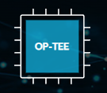

# OPTEE_ON_RK3399

OPTEE官方参考文档
https://optee.readthedocs.io/en/latest/building/gits/build.html#step-3-get-the-source-code
对于我们所使用的RK3399芯片来说  
使用的参考工程为ROCKPI4B开发板工程,版本应高于3.20.0 所用交叉编译工具链gcc_arm在[Toolchains文件夹](./Toolchains/)中
```
$ mkdir -p <optee-project>
$ cd <optee-project>
$ repo init -u https://github.com/OP-TEE/manifest.git -m rockpi4.xml [-b ${3.20.0}]
$ repo sync -j4 --no-clone-bundle
$ cd <optee-project>/build
$ make -j2 toolchains
$ make -j `nproc`  
```
repo下载参考链接
https://doc.embedfire.com/linux/rk356x/build_and_deploy/zh/latest/building_image/lubancat_sdk/lubancat_sdk.html#repo  
##编译后
```
$cd <optee-project>/out
```
编译结果为rockpi4.img
##烧录镜像
若为sd卡烧录，采用[balenaEtcher](./Toolchains/balenaEtcher)烧录

#如何移植至其他平台开发板
firefly-rk3399
##1、下载官方sdk、及rootfs
https://wiki.t-firefly.com/zh_CN/Firefly-RK3399/linux_compile_gpt.html
如果没有rootfs请使用瑞芯微解包工具，下载官方镜像解包
https://www.t-firefly.com/doc/download/page/id/3.html
##2、SDK编译，获取内核镜像Image，设备树dts，根文件系统rootfs。
##3、修改optee-project中的设置
###[1]主要配置文件有两个/u-boot_rockpi4.conf及rockpi4.mk
```
cd <optee-project>/build/kconfigs
sudo vim ./u-boot_rockpi4.conf  

cd <optee-project>/build
sudo vim ./rockpi4.mk
```
###修改rockpi4-mk
<a href="./Configs/rockpi4.mk">rockpi4.mk点击这里</a>
```
################################################################################
# U-Boot
################################################################################
UBOOT_DEFCONFIG_FILES := $(UBOOT_PATH)/configs/firefly-rk3399_defconfig \
			 $(ROOT)/build/kconfigs/u-boot_rockpi4.conf
```
```
################################################################################
# Linux kernel
################################################################################
LINUX_COMMON_FLAGS += ARCH=arm64 Image rockchip/rk3399-firefly.dtb \
			$(if $(filter y,$(LINUX_MODULES)),modules)
```
```
################################################################################
# Boot image, shall be copied to SD card
################################################################################
# U-Boot offset comes from CONFIG_SYS_MMCSD_RAW_MODE_U_BOOT_SECTOR=0x4000
# Partition no. 5 ends at 12288 + BR2_TARGET_ROOTFS_EXT2_SIZE (in kiB)
# File size needs to be slightly bigger to accomodate for whatever meta-data
rootfs-size-kib := $(shell echo $(BR2_TARGET_ROOTFS_EXT2_SIZE) | sed 's/M/*1024/')
p5-end-kib := $(shell echo $$((208896 + $(rootfs-size-kib))))
#p6-end-kib := $(shell echo $$(($(rootfs-size-kib)+2088960)))
img-size-kib := $(shell echo $$(($(p5-end-kib) + 1024)))

.PHONY: boot-img
boot-img: u-boot buildroot $(LINUX_PATH)/arch/arm64/boot/Image.gz
	mkdir -p $(BINARIES_PATH)
	rm -f $(BOOT_IMG)
	truncate -s $(img-size-kib)KiB $(BOOT_IMG)
	parted -s $(BOOT_IMG) \
		unit kiB \
		mklabel gpt \
		mkpart idbloader 32 4032 \
		mkpart primary fat32 4032 4096 \
		mkpart primary fat32 4096 8192 \
		mkpart uboot 8192 12288 \
		mkpart recovery 12288 143360\
		mkpart backpack 143360 208896\
		mkpart root fat32 208896 $(p5-end-kib)
#mkpart userdata $(p5-end-kib) $(p6-end-kib)
	sgdisk -u 7:17d61bff-8fdc-4089-b675-9be21b9f6ac7 $(BOOT_IMG)
	dd if=$(UBOOT_PATH)/idbloader.img of=$(BOOT_IMG) bs=1kiB seek=32 conv=notrunc
	dd if=$(UBOOT_PATH)/u-boot.itb of=$(BOOT_IMG) bs=1kiB seek=8192 conv=notrunc
	e2mkdir $(ROOT_IMG):/boot
	e2cp $(LINUX_PATH)/arch/arm64/boot/Image.gz $(ROOT_IMG):/boot
	e2cp $(LINUX_PATH)/arch/arm64/boot/dts/rockchip/rk3399-rock-pi-4b.dtb $(ROOT_IMG):/boot
ifeq ($(LINUX_MODULES),y)
	find $(BINARIES_PATH)/modules -type f | while read f; do e2cp -a $$f $(ROOT_IMG):$$(echo $$f | sed s@$(BINARIES_PATH)/modules@@); done
endif
	dd if=$(ROOT_IMG) of=$(BOOT_IMG) bs=1kiB seek=208896 conv=notrunc

.PHONY: boot-img-clean
boot-img-clean:
	rm -f $(BOOT_IMG)

clean: boot-img-clean

```
主要修改的是分区结构
官方镜像中导出的GPT[分区表](./Configs/parameter.txt)
root大小根据官方镜像分解出的rootfs.img大小确定
```
parted -s $(BOOT_IMG) \
	unit kiB \
	mklabel gpt \
	mkpart idbloader 32 4032 \
	mkpart primary fat32 4032 4096 \
	mkpart primary fat32 4096 8192 \
	mkpart uboot 8192 12288 \
	mkpart recovery 12288 143360\
	mkpart backpack 143360 208896\
	mkpart root fat32 208896 $(p5-end-kib)
sgdisk -u 7:17d61bff-8fdc-4089-b675-9be21b9f6ac7 $(BOOT_IMG)
```
这里的7：与root所在的分区位置相关，当前为第七分区
###修改u-boot_rockpi4.conf
<a href="./Configs/u-boot_rockpi4.conf">rockpi4.mk点击这里</a>
```
CONFIG_BOOTARGS="console=ttyS2,1500000 root=PARTUUID=17d61bff-8fdc-4089-b675-9be21b9f6ac7 loglevel=6 rootwait"
CONFIG_DEFAULT_FDT_FILE="/boot/rk3399-rock-pi-4b.dtb"
CONFIG_BOOTCOMMAND="setenv bootdev unknown; setenv kernel_addr_gz 0x0a280000; setenv kernel /boot/Image.gz; for d in 1 0; do test ${bootdev} = unknown && echo .. Looking for ${kernel} in mmc ${d}:7 && test -e mmc ${d}:7 ${kernel} && setenv bootdev ${d} && echo .. Found; done; if test ${bootdev} = unknown; then echo .. Kernel not found; else echo .. Loading kernel; ext2load mmc ${bootdev}:7 ${kernel_addr_gz} ${kernel}; unzip ${kernel_addr_gz} ${kernel_addr_r}; echo .. Loading DTB: mmc ${bootdev}:7 ${fdtfile}; ext2load mmc ${bootdev}:7 ${fdt_addr_r} ${fdtfile}; echo .. Booting kernel; booti ${kernel_addr_r} - ${fdt_addr_r}; fi"
```
第一个参数的PARTUUID与rockpi4.mk中的sgdisk指令对应
第二个参数选择正确的设备树，这里拷贝了firefly-rk3399的设备树进行了替换
```
setenv kernel_addr_gz 0x0a280000

ext2load mmc ${bootdev}:7 ${kernel_addr_gz} ${kernel}
ext2load mmc 1:7 0x0a280000 /boot/Image.gz
```
第三个参数设置的kernel_addr_gz为内核镜像加载进内存的地址。  
在uboot命令行模式中(开机时Ctrl+C)输入指令，可测试合适的加载内存地址，测试0x0a280000可以正确加载